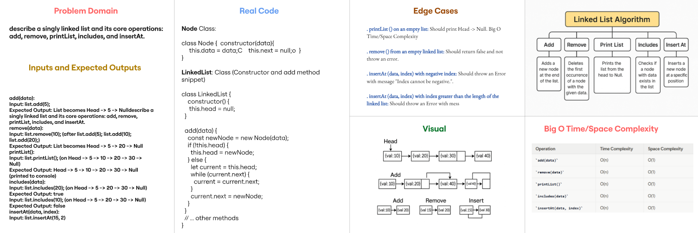
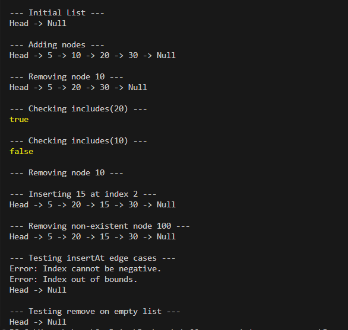

# Singly Linked List Implementation

## Problem Domain

This project implements a singly linked list data structure in JavaScript. A linked list is a linear collection of data elements, whose order is not given by their physical placement in memory. Instead, each element points to the next. This implementation includes a `Node` class and a `LinkedList` class with methods for common linked list operations.

## Inputs and Expected Outputs

### `add(data)`

- **Input**: `list.add(5);`
- **Expected Output**: List becomes `Head -> 5 -> Null`

### `remove(data)`

- **Input** : `list.remove(10);` (after `list.add(5); list.add(10); list.add(20);`)
- **Expected Output** : List becomes `Head -> 5 -> 20 -> Null`

### `printList()`

- **Input**: `list.printList();` (on `Head -> 5 -> 10 -> 20 -> 30 -> Null`)
- **Expected Output**: `Head -> 5 -> 10 -> 20 -> 30 -> Null` (printed to console)

### `includes(data)`

- **Input**: `list.includes(20);` (on `Head -> 5 -> 20 -> 30 -> Null`)
- **Expected Output**: `true`
- **Input**: `list.includes(10);` (on `Head -> 5 -> 20 -> 30 -> Null`)
- **Expected Output**: `false`

### `insertAt(data, index)`

- **Input**: `list.insertAt(15, 2);` (on `Head -> 5 -> 20 -> 30 -> Null`)
- **Expected Output**: List becomes `Head -> 5 -> 20 -> 15 -> 30 -> Null`

## Edge Cases

- **`printList()` on an empty list**: Should print `Head -> Null`.
- **`remove()` from an empty linked list**: Should return `false` and not throw an error.
- **`insertAt(data, index)` with negative index**: Should throw an `Error` with message "Index cannot be negative.".
- **`insertAt(data, index)` with index greater than the length of the linked list**: Should throw an `Error` with message "Index out of bounds.".

## Visual



## Algorithm

### Node Class

- **`constructor(data)`**: Initializes a new node with `data` and `next` pointing to `null`.

### LinkedList Class

- **`constructor()`**: Initializes an empty list with `head` pointing to `null`.

- **`add(data)`**:
  - Create a `newNode`.
  - If `head` is `null`, set `head` to `newNode`.
  - Else, traverse the list until the last node (`current.next` is `null`).
  - Set `current.next` to `newNode`.

- **`remove(data)`**:
  - If `head` is `null`, return `false`.
  - If `head.data` matches `data`, set `head` to `head.next` and return `true`.
  - Traverse the list with `current` and `prev` pointers.
  - If `current.data` matches `data`, set `prev.next` to `current.next` and return `true`.
  - If `data` is not found, return `false`.

- **`printList()`**:
  - Initialize `result` string with "Head".
  - Traverse the list from `head` to the end.
  - Append `-> [data]` for each node to `result`.
  - Append `-> Null` at the end.
  - Print `result` to console.

- **`includes(data)`**:
  - Traverse the list from `head`.
  - If `current.data` matches `data`, return `true`.
  - If end of list is reached without finding `data`, return `false`.

- **`insertAt(data, index)`**:
  - If `index` is negative, throw an error.
  - Create a `newNode`.
  - If `index` is 0, set `newNode.next` to `head` and `head` to `newNode`.
  - Else, traverse the list with `current` and `prev` pointers until `currentIndex` equals `index`.
  - If `currentIndex` equals `index` (meaning the position is found):
    - Set `newNode.next` to `current`.
    - Set `prev.next` to `newNode`.
  - If `current` is `null` and `currentIndex` is still less than `index` (meaning index is out of bounds), throw an error.

## Real Code

### `Node` Class

```javascript
class Node {
  constructor(data) {
    this.data = data;
    this.next = null;
  }
}
```

### `LinkedList` Class (Constructor and `add` method snippet)

```javascript
class LinkedList {
  constructor() {
    this.head = null;
  }

  add(data) {
    const newNode = new Node(data);
    if (!this.head) {
      this.head = newNode;
    } else {
      let current = this.head;
      while (current.next) {
        current = current.next;
      }
      current.next = newNode;
    }
  }
  // ... other methods
}
```

## Big O Time/Space Complexity

|       Operation        |  Time Complexity | Space Complexity |
|------------------------|------------------|------------------|
| `add(data)`            | O(n)             | O(1)             |
| `remove(data)`         | O(n)             | O(1)             |
| `printList()`          | O(n)             | O(1)             |
| `includes(data)`       | O(n)             | O(1)             |
| `insertAt(data, index)`| O(n)             | O(1)             |

*n* represents the number of nodes in the linked list.

## Console Output Screenshot


