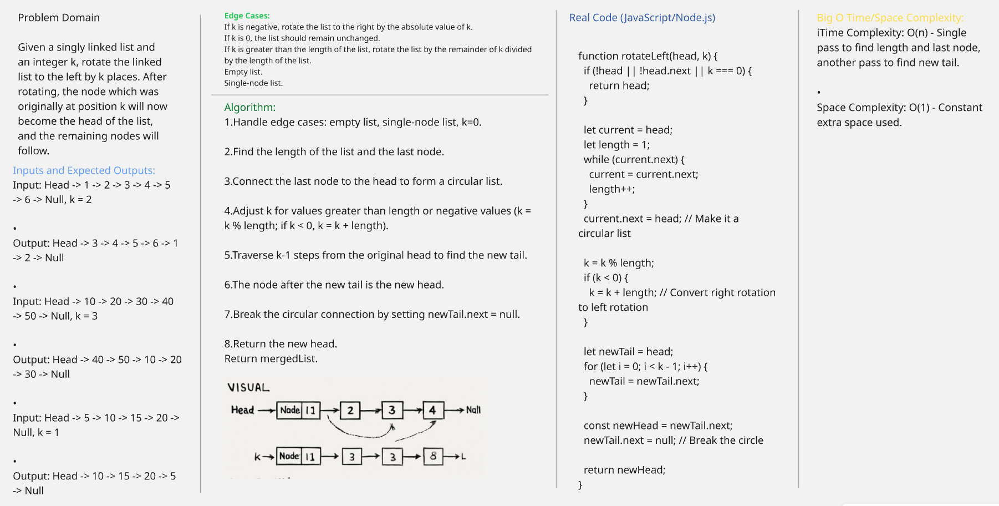

# Rotate Linked List Challenge

This folder contains the implementation for rotating a singly linked list to the left by `k` places.

## Problem Domain
Given a singly linked list and an integer `k`, rotate the linked list to the left by `k` places. After rotating, the node which was originally at position `k` will now become the head of the list, and the remaining nodes will follow.

## Inputs and Expected Outputs
*   **Input:** Head -> 1 -> 2 -> 3 -> 4 -> 5 -> 6 -> Null, k = 2
*   **Output:** Head -> 3 -> 4 -> 5 -> 6 -> 1 -> 2 -> Null
*   **Input:** Head -> 10 -> 20 -> 30 -> 40 -> 50 -> Null, k = 3
*   **Output:** Head -> 40 -> 50 -> 10 -> 20 -> 30 -> Null
*   **Input:** Head -> 5 -> 10 -> 15 -> 20 -> Null, k = 1
*   **Output:** Head -> 10 -> 15 -> 20 -> 5 -> Null

## Edge Cases
*   If `k` is negative, rotate the list to the right by the absolute value of `k`.
*   If `k` is 0, the list should remain unchanged.
*   If `k` is greater than the length of the list, rotate the list by the remainder of `k` divided by the length of the list.
*   Empty list.
*   Single-node list.

## Visual

## Algorithm
1.  Handle edge cases: empty list, single-node list, k=0.
2.  Find the length of the list and the last node.
3.  Connect the last node to the head to form a circular list.
4.  Adjust k for values greater than length or negative values (k = k % length; if k < 0, k = k + length).
5.  Traverse `k-1` steps from the original head to find the new tail.
6.  The node after the new tail is the new head.
7.  Break the circular connection by setting `newTail.next = null`.
8.  Return the new head.

## Real Code (JavaScript/Node.js)
```javascript
function rotateLeft(head, k) {
  if (!head || !head.next || k === 0) {
    return head;
  }

  let current = head;
  let length = 1;
  while (current.next) {
    current = current.next;
    length++;
  }
  current.next = head; // Make it a circular list

  k = k % length;
  if (k < 0) {
    k = k + length; // Convert right rotation to left rotation
  }

  let newTail = head;
  for (let i = 0; i < k - 1; i++) {
    newTail = newTail.next;
  }

  const newHead = newTail.next;
  newTail.next = null; // Break the circle

  return newHead;
}
```

## Big O Time/Space Complexity
*   **Time Complexity:** O(n) - Single pass to find length and last node, another pass to find new tail.
*   **Space Complexity:** O(1) - Constant extra space used.

## Implementation Details
- `rotateLinkedList.js`: Contains the `rotateLeft(k)` function.
- `tests/rotateLinkedList.test.js`: Contains unit tests for the `rotateLeft(k)` function.

## How to Run Tests
To run the tests for this implementation, navigate to the `Linked-List-Implementation` directory and execute the following command:

```bash
npm test tests/rotateLinkedList.test.js
```

