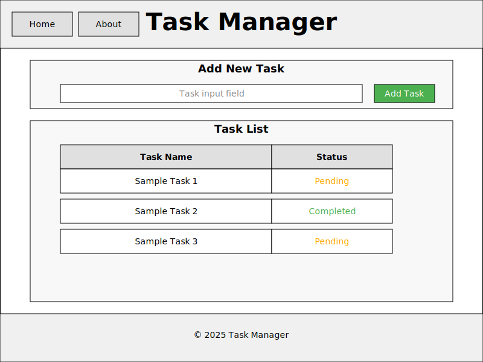
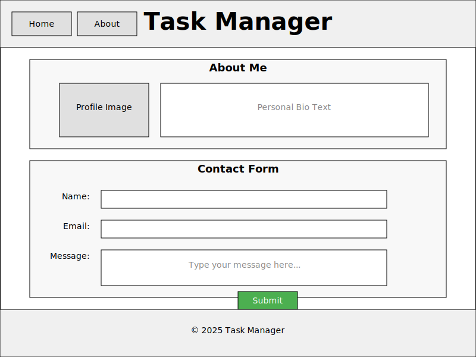

# My-Tasks

A simple task manager website where users can display their tasks, prioritize them, and check the status for each one.

## Wireframes

### Home Page Wireframe


The Home page includes:
- Header with navigation menu
- Task input section with text field and "Add Task" button
- Task table with Name and Status columns
- Footer with copyright information

### About Page Wireframe


The About page includes:
- Header with navigation menu
- Personal section with profile image and bio
- Contact form with Name, Email, and Message fields
- Footer with copyright information

## Project Structure

```
task-manager/
├── index.html
├── about.html
├── css/
│   └── styles.css
├── js/
│   └── app.js
└── README.md
```

## Features

- Add new tasks
- View task list with status
- Mark tasks as complete or in progress
- About page with contact form
- Responsive design for mobile and desktop
