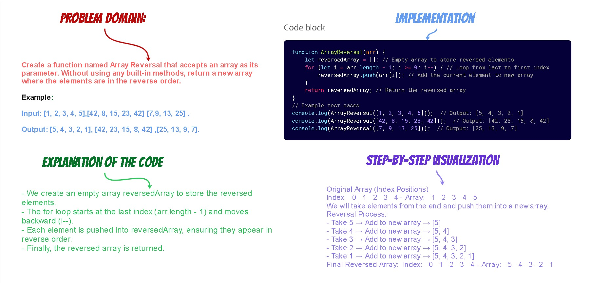
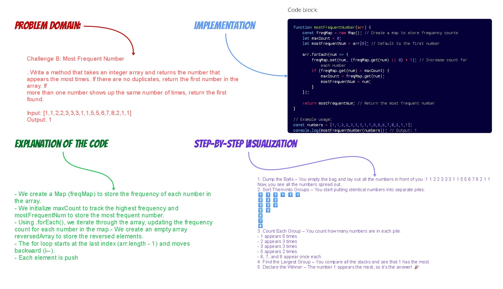
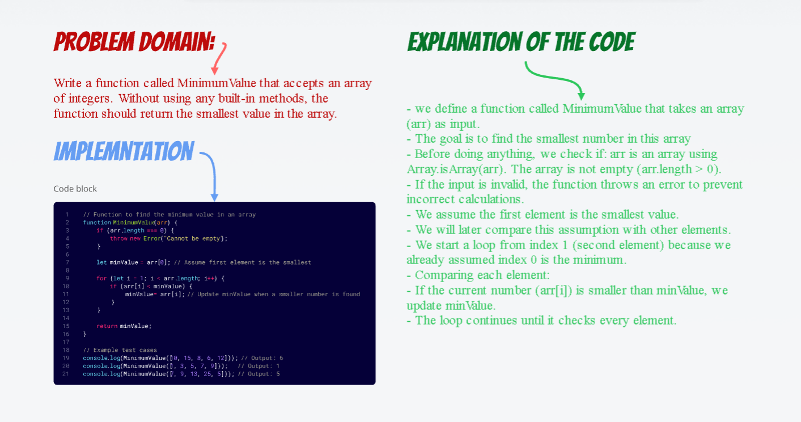

# challenges-and-data-structures
The challenges-and-data-structures repository collects coding challenges and data structures to improve problem-solving skills. It includes whiteboard solutions, algorithm implementations, and organized documentation. Explore the repo, learn key concepts, and contribute by adding new challenges! 

## Whiteboard Images

### Challenge 1. A: Array Reversal: A function named ArrayReversal that accepts an array as its parameter.
Without using any built-in methods, return a new array where the elements are in
the reverse order.

### Challenge 1. B: Most Frequent Number: A method that takes an integer array and returns the number that
appears the most times. If there are no duplicates, return the first number in
the array. If more than one number shows up the same number of times,
return the first found.

## Challenge 2: Minimum Value

