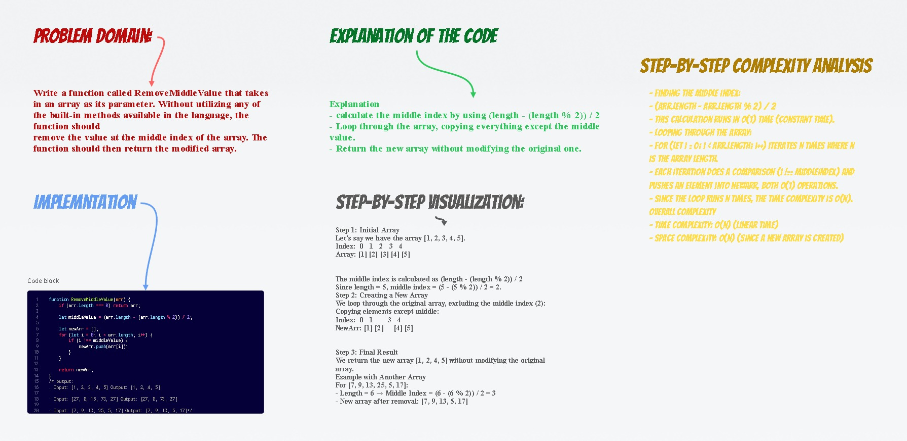

# challenges-and-data-structures
The challenges-and-data-structures repository collects coding challenges and data structures to improve problem-solving skills. It includes whiteboard solutions, algorithm implementations, and organized documentation. Explore the repo, learn key concepts, and contribute by adding new challenges! 

## Whiteboard Images

## Challenge 1. A: Array Reversal

## Challenge 1. B: Most Frequent Number

## Challenge 2: Minimum Value

## Challenge 3: Reverse Characters
#### Challenge  Description: A function called ReverseCharacters takes a single string as input. Without using any built-in methods, the function should return the string with all characters
reversed.

## Challenge 4: Remove Middle Value

### Challenge Description
This challenge aims to remove the middle value from a given dataset, such as an array or a linked list. If the dataset has an even number of elements, the function should remove the lower middle value.

### Approach:
- **Step 1:** Determine the length of the dataset.
- **Step 2:** Identify the middle index.
- **Step 3:** Remove the middle value efficiently.
- **Step 4:** Return the updated dataset.

